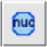

# NucMetrics

An ImageJ/Fiji macro toolset for computing DNA staining-based image metrics for live-cell tracking of chromatin organization.

NucMetrics computes three metrics from nuclear DNA staining images:
- **CV** (Coefficient of Variation) — computed from raw pixel intensities
- **1-Gini** (complement of Gini coefficient) — computed from min-max normalized intensities
- **DSI** (Diffuse Signal Index) — computed from min-max normalized intensities

## Installation

There are two ways to install NucMetrics. **Method A** is recommended for repeated use.

### Method A: Install to the toolsets folder (recommended)

This makes NucMetrics permanently available in the `>>` toolbar menu.

1. Download `NucMetrics_Toolset.ijm`
2. Save it in the Fiji application folder at:

   **`Fiji.app/macros/toolsets/NucMetrics_Toolset.ijm`**

   The typical full path by operating system:

   | OS | Full path |
   |----|-----------|
   | **macOS** | `/Applications/Fiji.app/macros/toolsets/NucMetrics_Toolset.ijm` |
   | **Windows** | `C:\Users\<YourName>\Fiji.app\macros\toolsets\NucMetrics_Toolset.ijm` |
   | **Linux** | `~/Fiji.app/macros/toolsets/NucMetrics_Toolset.ijm` |

   > **💡 Don't know where Fiji is installed?** Open Fiji, go to `Plugins > Macros > Edit...`. The file browser opens inside the `macros` folder. You should see a subfolder called `toolsets` — that's where the file goes. If you don't see it, you can create it.

   > ⚠️ **Common mistake:** The file must be inside the **`toolsets`** subfolder, NOT directly in `macros`. If placed in the wrong folder, the toolset will not appear in the `>>` menu.

3. Open Fiji (no restart needed if already open). Click the **`>>`** button on the right end of the toolbar and select **NucMetrics_Toolset**.

4. The NucMetrics icon appears on the toolbar:

   

> **Note:** Each time you open Fiji, you need to click `>>` and select NucMetrics_Toolset to load it into the toolbar. The same procedure can be used for ImageJ.

### Method B: Temporary install via menu (quick start)

This loads NucMetrics for the current session only. You will need to repeat this each time you open Fiji.

1. Download `NucMetrics_Toolset.ijm` to any location on your computer
2. In Fiji, go to `Plugins > Macros > Install...`
3. Navigate to and select `NucMetrics_Toolset.ijm`
4. The NucMetrics icon appears on the toolbar for the current session

### First use

> ⚠️ **Important:** Always open a DNA-stained image **before** clicking the NucMetrics icon. If no image is open, NucMetrics will show an error.

1. Open a DNA-stained image in Fiji (`File > Open...`)
2. Click the NucMetrics icon on the toolbar (or press `1` on the numpad)
3. Select a mode, set the DSI threshold (tau), and click OK

**Requirements:** Fiji or ImageJ (1.53b or later). No additional plugins or dependencies.

## Tutorial: Quick test with example data

Try NucMetrics using the example images provided in this repository.

### Test 1: Single nucleus with Mode 1 (Current Selection)

1. Open `example_data/compact.tif` in Fiji
2. Click the NucMetrics icon
3. Select **Current Selection** mode, keep tau = 0.3, click OK
4. NucMetrics will prompt you to draw an ROI — draw a freehand selection around the nucleus, then click OK
5. Check the Results table. Expected values (approximate):
   - CV ≈ 0.58, 1-Gini ≈ 0.62, DSI ≈ 0.37

### Test 2: Single nucleus with Mode 3 (Binary Mask)

1. Open `example_data/compact.tif` in Fiji
2. Also open `example_data/compact_mask.tif`
3. Click on the 'compact.tif' image window to make it active
4. Click the NucMetrics icon
5. Select **Binary Mask** mode → select the mask image from the dropdown (compact_mask.tif)→ click OK
6. Check the Results table for CV, 1-Gini, and DSI values

### Test 3: Multiple nuclei with Mode 4 (Auto-Generate Binary Mask)

1. Open `example_data/multiple_nuc.tif` in Fiji
2. Click the NucMetrics icon
3. Select **Auto-Generate Binary Mask** mode → choose a threshold method (Li is the default and works well for this example; try Li, Otsu, or Triangle and compare) → click OK
4. Review the generated mask in the new window
5. Click OK to compute metrics, or Cancel to keep the mask for manual editing

> **Tip:** The built-in auto-thresholding may not work well for all datasets. If you have a segmentation pipeline that produces better masks for your data, save the mask as a binary image and use **Mode 3 (Binary Mask)** instead.

> **Validation:** The example images (`compact.tif`, `decompact.tif`) are the same ones used in Fig. 1 of the manuscript. NucMetrics outputs on these images have been validated against the Python analysis code to produce identical CV, 1-Gini, and DSI values.

## Modes

> ⚠️ **Stack processing note:** For single time-point images, multiple nuclei per field of view are fully supported. For time-series (stack) data, the field of view should contain a **single nucleus** — whole-stack mode does not perform multi-object tracking across time points. For multi-nuclei time-lapse data, either (1) crop individual nuclei into separate single-nucleus stacks, or (2) generate per-nucleus binary mask stacks using your own segmentation/tracking pipeline, then use Mode 3 (Binary Mask, whole stack) to compute metrics.

### Mode 1: Current Selection

Draw a freehand, polygon, or oval ROI around a nucleus, then run NucMetrics. If no ROI is drawn, NucMetrics will activate the Freehand tool and prompt you to draw one.

### Mode 2: ROI Manager

Pre-load multiple ROIs into the ROI Manager (must be open before running), then run NucMetrics. All ROIs are batch-processed and results are output to the Results table.

> **Note:** The ROI Manager window must be open with ROIs added before selecting this mode.

### Mode 3: Binary Mask

Use an external binary mask image to define nuclear regions. The mask image must already be open in Fiji/ImageJ alongside the original DNA-stained image.

- **Single slice:** Select a mask image from the dropdown and compute metrics for the current slice.
- **Whole stack:** If both the original image and the mask are stacks with matching dimensions, NucMetrics can process all corresponding planes. Each mask plane defines the nuclear region for the matching plane in the original image. This mode measures one nucleus per plane and is intended for single-nucleus stacks.

> **Note:** The mask image must be opened in Fiji/ImageJ before running NucMetrics. "Binary mask" refers to selecting an already-open mask window, not importing a file.

### Mode 4: Auto-Generate Binary Mask

Automatically generate a binary mask using intensity thresholding (Li, Otsu, or Triangle), followed by morphological cleanup (fill holes, opening) and particle analysis.

**Workflow:**
1. NucMetrics generates a binary mask and displays it in a new window
2. Review the mask visually
3. Click OK to compute metrics using the generated mask, or Cancel to keep the mask only for manual editing

**Stack support:**
- **Single slice:** Generates a mask for the currently displayed slice
- **Entire series:** Generates a mask stack across all time points (T) or Z-slices. For hyperstacks with both T and Z dimensions, you can choose which axis to iterate over while keeping the other fixed at the current position
- Whole-stack mode is designed for **single-nucleus** stacks (one nucleus per field of view). It does not perform multi-object tracking across time points

> **Tip:** For multi-nuclei time-lapse data, use Mode 4 to generate a binary mask stack, manually review/correct it, then use Mode 3 (Binary Mask, whole stack) to compute metrics.

## Parameters

| Parameter | Default | Description |
|-----------|---------|-------------|
| DSI threshold (tau) | 0.3 | Normalized intensity threshold for DSI computation |
| Min nucleus area | 30 px | Minimum object size for segmentation modes |
| Auto-threshold method | Li | Thresholding algorithm (Li, Otsu, or Triangle) |

## How metrics are computed

All metrics are computed from pixel intensities within the nuclear ROI.

**CV** = sigma / mu, where sigma and mu are the standard deviation and mean of raw pixel intensities.

**1-Gini**: Raw intensities are min-max normalized to [0, 1]. The Gini coefficient is computed as:

```
Gini = [2 * sum(i * x_sorted_i)] / [N * sum(x)] - (N + 1) / N
```

The reported value is 1 - Gini, bounded between 0 (maximally unequal) and 1 (perfectly uniform).

**DSI**: Raw intensities are min-max normalized to [0, 1]. DSI is the fraction of normalized pixels exceeding the threshold tau:

```
DSI = count(x_i > tau) / N
```

DSI ranges from 0 to 1, with higher values indicating more spatially uniform DNA signal distribution.

## Output

Results are displayed in the ImageJ Results table with the following columns:

| Column | Description |
|--------|-------------|
| Label | Nucleus identifier (e.g., Auto_1, T001_N1) |
| N_pixels | Number of pixels in the nuclear ROI |
| Mean_raw | Mean raw pixel intensity |
| StdDev_raw | Standard deviation of raw pixel intensity |
| CV | Coefficient of variation |
| 1-Gini | Complement of the Gini coefficient |
| DSI | Diffuse Signal Index |

For whole-stack processing, labels follow the format `T###_N1` (time point) or `Z###_N1` (Z-slice) or `S###_N1` (plain stack slice).

Results can be exported via `File > Save As...` from the Results table.

## Citation

If you use NucMetrics, please cite:

> Kang M, Cabral AT, Sawant M, Thiam HR (2026). Benchmarking three simple DNA staining-based image metrics for live-cell tracking of chromatin organization. *bioRxiv*. [https://doi.org/10.64898/2026.03.30.715467](https://doi.org/10.64898/2026.03.30.715467)

## License

MIT
